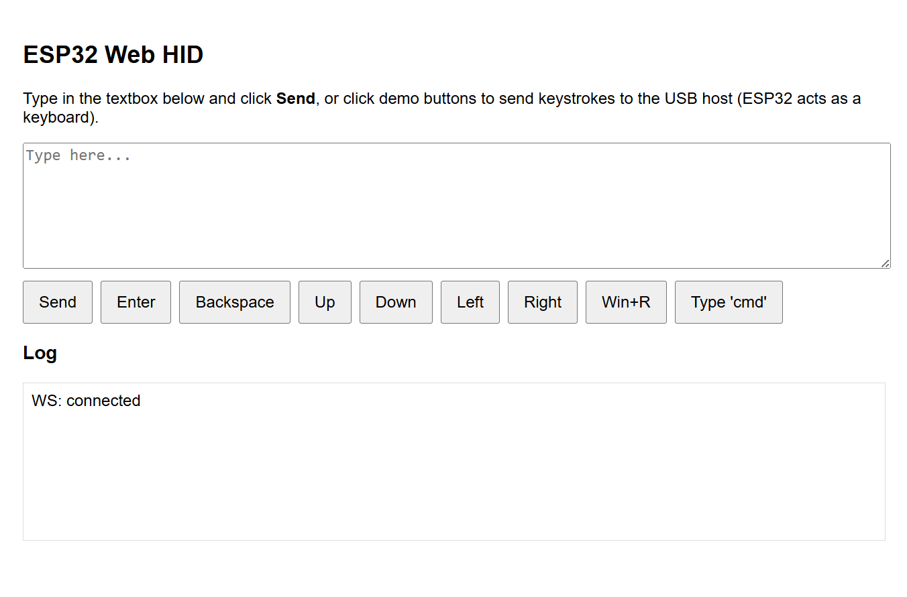

# ESP32-S3 WebApp-Controlled USB HID Keyboard

This stage builds on the previous USB HID keyboard examples and introduces a WebSocket-based WebApp hosted directly on the ESP32-S3.
Any device connected to the ESP32 Wi-Fi AP can open the web page and send keystrokes to the PC where the ESP32 is connected via USB.

**Important Warning**: 
This tutorial is for educational purposes only.
USB HID automation can be misused for malicious activities (BadUSB attacks).
Do not use this code in any illegal, harmful, or unauthorized environment.

---

## Overview
In this stage you will learn how to:
- Use ESP32-S3 as a USB HID Keyboard using TinyUSB
- Host a Wi-Fi Access Point + Web Server on the ESP32
- Build a WebSocket-powered WebApp for real-time communication
- Send:
    - Text strings
    - Special keys (Enter, Backspace, Arrows, etc.)
    - Key combinations (Win+R, etc.)

The result:
The ESP32 hosts a webpage → You enter text or click buttons → Keystrokes are sent over WebSocket → ESP32 injects them into the connected computer as USB keyboard input.

## Hardware Setup

No external wiring needed.

The example uses:
- GPIO 0 (BOOT button) → to trigger the HID sequence
- USB port → used as USB device HID keyboard

---

## Software Requirements

- **ESP-IDF v5.1 or later**
- **Serial terminal** (`idf.py monitor` or VS Code IDF Monitor)

---

## Project Structure

```bash
stage3_keystrokes_web_ui/
│── main/
│   ├── tusb_hid_example.c   # HID keyboard implementation
│   ├── CMakeLists.txt
│   ├── idf_component.yml
│── CMakeLists.txt
│── sdkconfig
│── sdkconfig.defaults
│── README.md
```
---

## Build & Flash

You can run this example **either using the ESP-IDF command line**  
or **directly through VS Code’s ESP-IDF Extension**.

### Option 1 — Using ESP-IDF Terminal

``` bash
idf.py set-target esp32s3
idf.py build
idf.py -p <PORT> flash monitor
```

### Option 2 — Using VS Code

1. Open this project folder in VS Code.
2. Ensure the Espressif IDF extension is installed and configured.
3. In the VS Code status bar, select your target:
    - Target: `esp32s3`
    - Port: your board’s COM port
4. Click the “Build, Flash and Monitor” button

When running, go to `http://192.168.10.10/` to open the web page

---

## What the Code Does

### ESP32-S3 USB HID Keyboard
The code is based on the official Espressif TinyUSB HID example, but extended to support:
- ASCII → HID mapping
- Automatic Shift handling
- Special keys
- Modifier combinations
- String typing

### Web Server + WebSocket
ESP32 hosts:
- `/` → WebUI (HTML)
- `/app.js` → JavaScript WebSocket client
- `/ws` → WebSocket endpoint

### Wi-Fi Access Point Mode
The ESP32 creates its own network:
- SSID: ESP HID
- Password: 12345678
- Static IP: 192.168.10.10
Users connect to the AP → Open browser → Control HID.

### WebApp Features
Inside webpage you can:
- Send text via textbox
- Send single-key commands
- Execute key combos like `Win+R`
- View logs of sent/received packets

## How It Works

1. Wi-Fi Setup  
ESP32 boots into AP mode and waits for a client to connect.

2. Start Web Server  
HTTP + WebSocket endpoints are registered.

3. Host WebApp  
The browser serves a clean UI with:
    - Textbox
    - Buttons (Enter, Arrow keys, Win+R, etc.)
    - Log window

4. Send Commands via WS  
Browser → WebSocket → JSON messages:
    ```json
    { "type": "string", "value": "Hello" }
    { "type": "key", "value": "ENTER" }
    { "type": "combo", "value": ["GUI","r"] }
    ```
5. HID Injection  
ESP32 converts JSON messages → HID keycodes → Injects keystrokes.

When powered via USB:
- The ESP32-S3 enumerates as a USB keyboard
- It waits until the PC recognizes the USB device
- When the BOOT button (GPIO 0) is pressed:
- It opens the CMD
- Then it prints Hello World ESP32

### Webapp UI



---

## Notes
This project was tested on:
- Board: ESP32-S3-DevKitC-1
- ESP-IDF: v5.5.1
- OS: Windows 11 + VS Code + ESP IDF Extension
- Serial Baud: 115200 bps
---

## What You’ll Learn
- How to send advanced keystrokes as a USB keyboard
- How to send modifier keys such as Shift, Ctrl, GUI
- How to automatically handle uppercase characters using Shift
- How to send full strings via HID using ESP32-S3
- How to build a keystroke automation workflow

## Important Disclaimer — Educational Use Only

This project demonstrates how to use the ESP32-S3 as a USB HID keyboard for learning and experimentation.  
It must **not** be used for any illegal, harmful, or unauthorized activity.

You must **only** run USB HID keystroke automation on computers and systems you own or have explicit permission to test.

Misusing this project for unauthorized computer access or automated keystroke injection may violate computer security laws.

This tutorial is intended strictly for **educational and ethical purposes**.

---

## License
MIT License © 2025 — Chandima Jayaneththi

